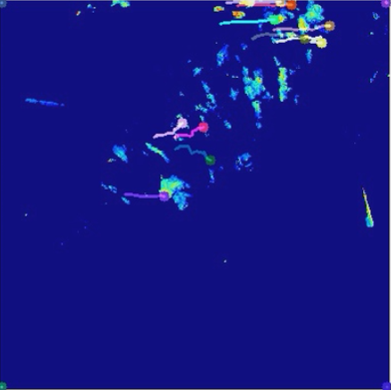
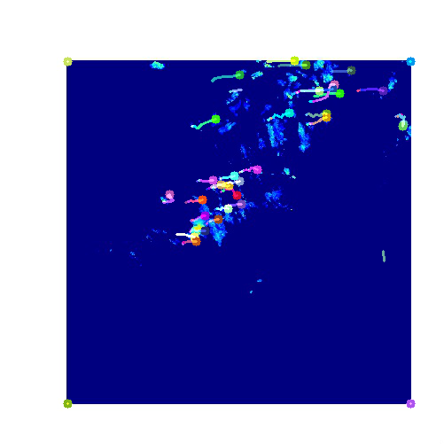
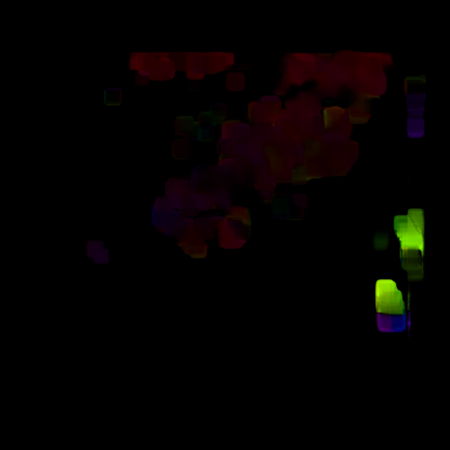

# Feature Tracking Thinking and Work

HaleQiu

Jun. 21

## Raw data

Raw data in ICDM have the features as follows:

1. sparse intensity
2. Blank outside the range of the radar
3. range from 0-80 as intensity


## Feature Tracking

### KLT(Kanade–Lucas–Tomasi feature tracker)

KLT makes use of spatial intensity information to direct the search for the position that yields the best match.

1. GFT (cv2.goodFeaturesToTrack) 

* finding the key points in the frame 
  * ShiTomasi corner detection

2. Lucas-Kanade Method

#### cv2.goodFeaturesToTrack

this is the key point select method provided by cv2 and cooperated with the Lucas-Kanade method.

The function finds the most **prominent corners** in the image or in the specified image region
#### Video:
https://github.com/haleqiu/data-processing/blob/master/doc/Lucas-KanadeOpticalFlow.avi



#### Improvement

key point is the problem of improvement, Changing the block size from 7 to about 2 make a better performance on the key point selection.
With smaller block size we have a better performance on keyponit selection

```python
# params for ShiTomasi corner detection
feature_params = dict( maxCorners = 100,
                       qualityLevel = 0.3,
                       minDistance = 7,
                       blockSize = 2 )
```
#### Video:
https://github.com/haleqiu/data-processing/blob/master/doc/Improved-KLT.avi




### Dense Optical Flow

It is based on Gunner Farneback's algorithm which is explained in "Two-Frame Motion Estimation Based on Polynomial Expansion" by Gunner Farneback in 2003.

Notice:

* Direction corresponds to Hue value of the image. 
* Magnitude corresponds to Value plane.
#### Video:
https://github.com/haleqiu/data-processing/blob/master/doc/DenseOptivalFlow.avi




## Problems and Question

### 1. Different Key point

Here the key point selecter is focusing on the corners detected using Shi-Tomasi algorithm.

Maybe an alternative key point can be used like SIFT

### 2. Boundary problem

The cloud we tracked get out of the screen and the new colud it genenrated is not tracked.

* Thus Segmentation may needed and do the key point selection multiple times
* Besides, a sitable block size needs for consideration

### 3. Misunderstanding: Locas-Kanade Method and KLT 

LK Mthod is parts of KLT, Firstly fo the key points selection and then do the LK method on the tracking parts.

**KLT is not sparse optical flow and the documents in opencv gives some misunderstanding** 

https://stackoverflow.com/questions/47662538/lucas-kanade-method-vs-kanade-lucas-tomasi-feature-tracker


